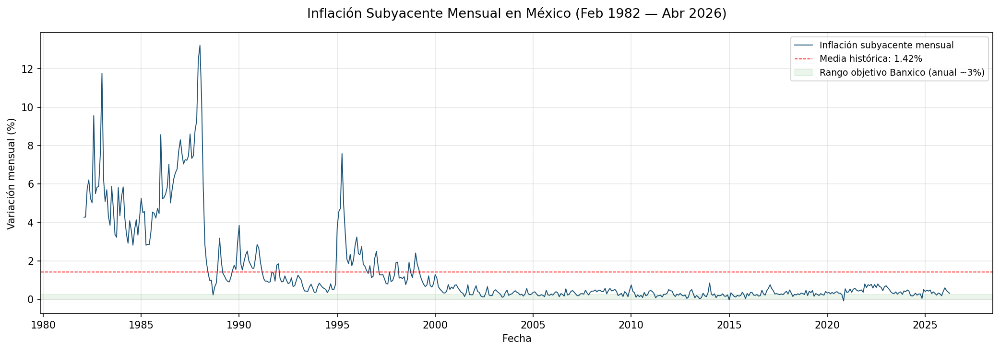
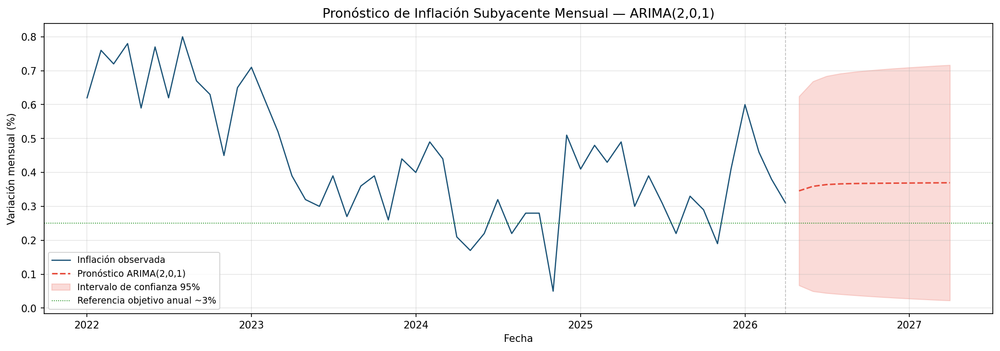
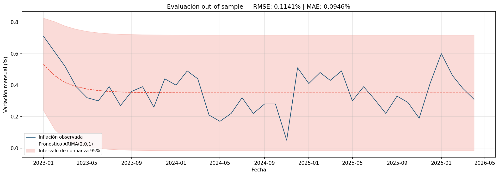

# Pronóstico de Inflación Subyacente en México con ARIMA

Modelo de series de tiempo para pronosticar la inflación subyacente mensual 
en México, utilizando datos históricos del Sistema de Información Económica 
(SIE) del Banco de México.

## Objetivo

Construir y evaluar un modelo ARIMA para pronosticar la variación mensual 
del índice de precios subyacente, que excluye energéticos y agropecuarios 
y es el indicador de referencia para las decisiones de política monetaria 
de Banxico.

## Metodología

1. Obtención de datos vía API del SIE Banxico (Serie SP74660)
2. Análisis exploratorio y visualización de la serie histórica (Feb 1982 — Abr 2026)
3. Prueba de estacionariedad Augmented Dickey-Fuller (ADF)
4. Identificación del orden mediante gráficas ACF y PACF
5. Selección del modelo por criterio AIC entre 9 especificaciones candidatas
6. Diagnóstico de residuales (Ljung-Box, Jarque-Bera)
7. Pronóstico a 12 meses con intervalos de confianza al 95%
8. Evaluación out-of-sample (Ene 2023 — Abr 2026)
9. Cálculo de inflación anual implícita en el pronóstico

## Resultados

| Métrica | Valor |
|---|---|
| Modelo seleccionado | ARIMA(2, 0, 1) |
| Periodo de estimación | Ene 2000 — Abr 2026 |
| AIC | -325.14 |
| RMSE out-of-sample | 0.1141% |
| MAE out-of-sample | 0.0946% |

**Pronóstico:** inflación subyacente mensual de ~0.35-0.37% para mayo 2026 
— abril 2027, equivalente a una tasa anual implícita de 4.3%-4.8%.

## Visualizaciones

### Serie histórica

### Pronóstico a 12 meses

### Evaluación out-of-sample

## Herramientas

- **Python** — pandas, statsmodels, matplotlib
- **Fuente de datos** — API SIE Banxico (Serie SP74660)
- **Entorno** — Jupyter Lab

## Estructura del repositorio
├── analisis_inflacion_subyacente.ipynb  # Notebook principal
├── serie_historica.png                  # Gráfica serie histórica
├── acf_pacf.png                         # Gráficas ACF y PACF
├── diagnostico_residuales.png           # Diagnóstico de residuales
├── pronostico.png                       # Pronóstico a 12 meses
└── evaluacion_out_of_sample.png         # Evaluación out-of-sample

## Posibles Extensiones

- Modelo SARIMA con componente estacional explícito (rezago 12)
- Modelo VAR incorporando tipo de cambio USD/MXN y tasa TIIE
- Comparación contra modelo benchmark de caminata aleatoria
